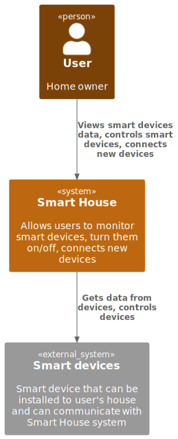
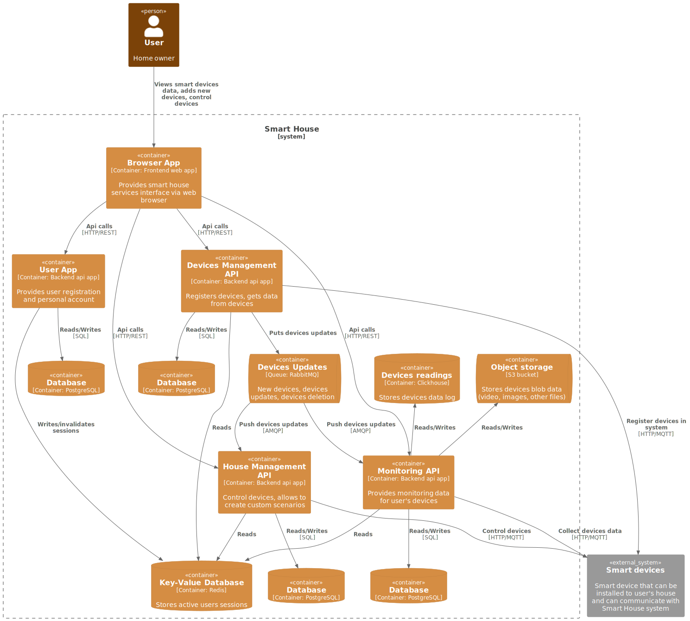
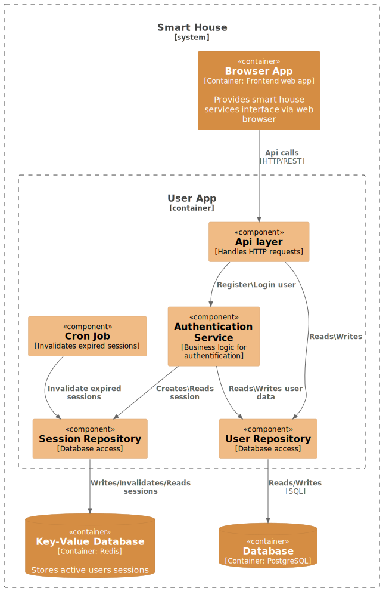
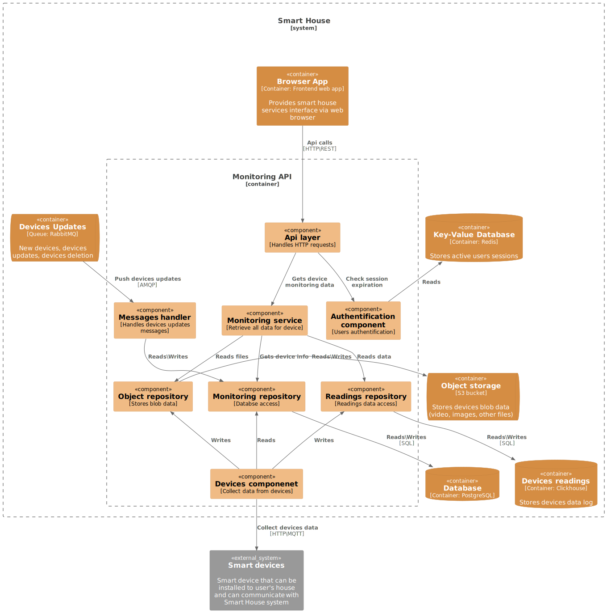
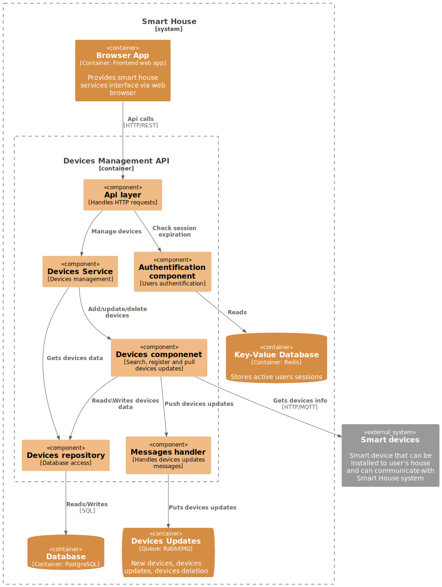
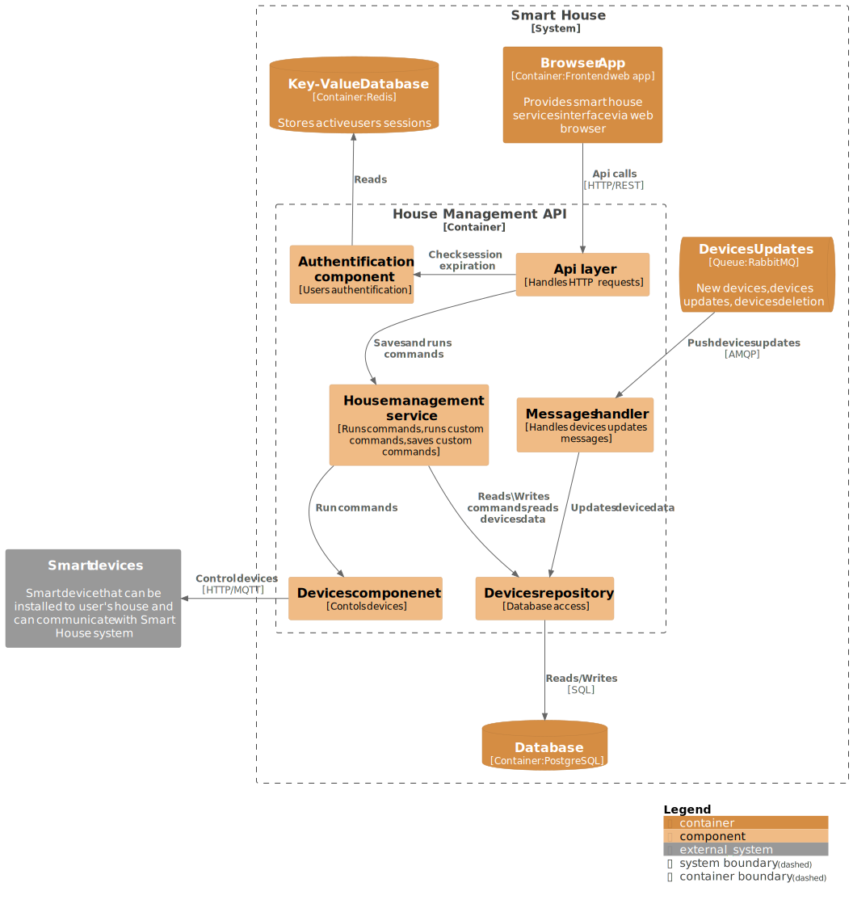
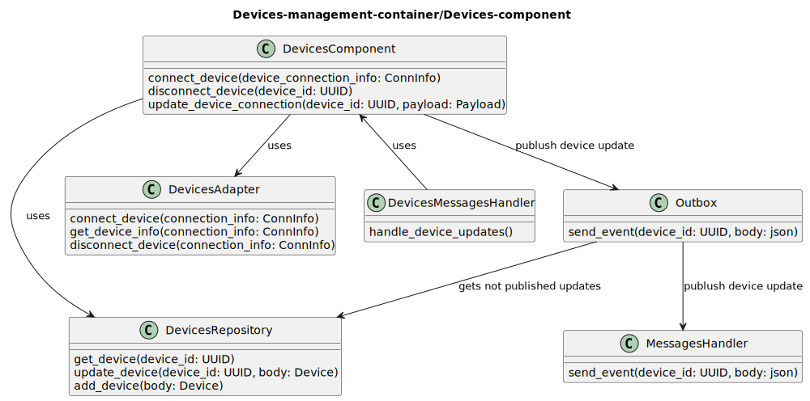
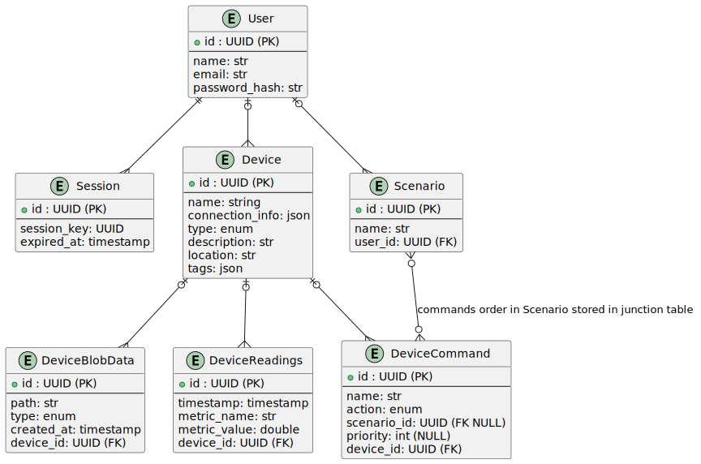

# Project_template

Это шаблон для решения проектной работы. Структура этого файла повторяет структуру заданий. Заполняйте его по мере работы над решением.

# Задание 1. Анализ и планирование

<aside>

Чтобы составить документ с описанием текущей архитектуры приложения, можно часть информации взять из описания компании и условия задания. Это нормально.

</aside>

### 1. Описание функциональности монолитного приложения

**Управление отоплением:**

- Пользователи могут удалённо включать/выключать отопление в своих домах.
- Система может включать и отключать отопление

**Мониторинг температуры:**

- Пользователи могут просматривать текущую температуру в своих домах через веб-интерфейс
- Система получает данные о температуре с датчиков, установленных в домах через синхронный запрос

### 2. Анализ архитектуры монолитного приложения

Монолитное приложение на GO c СУБД PostgreSQL, все взаимодействия и запросы синхронные, разворачивается и обновляется все приложение целиком

### 3. Определение доменов и границы контекстов

#### As is домены:

- Домен: управление пользователями
- Домен: управление отоплением
- Домен: мониторинг температуры
	- поддомен: сбор данных температуры с датчиков
 	- поддомен: отображение температуры

#### To be домены:

- Домен: управление пользователями и аккаунтами

- Домен: управление устройствами
	- поддомен: подключение новых устройств
		- контекст: отдельный контекст под каждый тип устройства (камеры, датчики темпереатуры, включатели/выключатели)
	- поддомен: реестр устройств/обновление данных об устройствах

- Домен: управление домом (тут в том числе планируется программирование системы пользователем)
	- поддомен: выполнение команд и сценариев
	- поддомен: настройка сценариев

- Домен: мониторинг
	- поддомен: сбор данных от устройств
	- поддомен: отображение и форматирование данных

### 4. Проблемы монолитного решения

- Синхронное получение данных о температуре от датчика во время запроса инфо о датчике может привести к недоступности приложения при недоступности датчика. Для умного дома просмотр температуры в реальном времени не должно ялвляться критичным, можно показать и устаревшую на 1-5 минут температуру, получив взамен бо&#x301;льшую доступность сервиса

- усложнено масштабирование:
	на чаcть с регистрацией пользователей нагрузка будет явно очень низкая (не часто заводится новый пользователь). На часть с просмотром температуры запросов будет явно больше (например пользователь захочет смотреть каждую минуту на текущую температуру). Часть с управлением, вероятно, будет иметь больше запросов, чем на регистрацию новых пользователей, но меньшу чем на просмотр температуры. При увеличении количества пользователей есть смысл выделять разное количество ресурсов на каждую часть приложения.

- добавление новых фич, например, управление электричеством, будет каждый раз вызывать ненужные риски связанные с выкаткой (потенциальные даунтаймы, неожиданные ошибки) в частях приложения, которые обновляются редко, например, регистрация новых пользователей.

- при увеличении количества кода в приложении, выкатка и тестировани начнет занимать все больше времени потому что надо тестировать все приложение целиком

### 5. Визуализация контекста системы — диаграмма С4

# Задание 2. Проектирование микросервисной архитектуры

**Диаграмма контейнеров (Containers)**

**Диаграмма компонентов (Components)**

**Диаграмма кода (Code)**

# Задание 3. Разработка ER-диаграммы

# Задание 4. Создание и документирование API

### 1. Тип API

Укажите, какой тип API вы будете использовать для взаимодействия микросервисов. Объясните своё решение.

### 2. Документация API

Здесь приложите ссылки на документацию API для микросервисов, которые вы спроектировали в первой части проектной работы. Для документирования используйте Swagger/OpenAPI или AsyncAPI.

# Задание 5. Работа с docker и docker-compose

Новое приложение [temperature-api](apps/temperature_api)  
Обновленный [docker-compose](apps/docker-compose.yml)

# **Задание 6. Разработка MVP**

Необходимо создать новые микросервисы и обеспечить их интеграции с существующим монолитом для плавного перехода к микросервисной архитектуре. 

### **Что нужно сделать**

1. Создайте новые микросервисы для управления телеметрией и устройствами (с простейшей логикой), которые будут интегрированы с существующим монолитным приложением. Каждый микросервис на своем ООП языке.
2. Обеспечьте взаимодействие между микросервисами и монолитом (при желании с помощью брокера сообщений), чтобы постепенно перенести функциональность из монолита в микросервисы. 

В результате у вас должны быть созданы Dockerfiles и docker-compose для запуска микросервисов. 