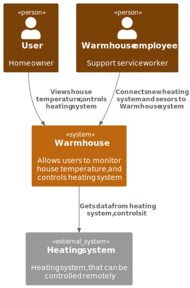

# Project_template

Это шаблон для решения проектной работы. Структура этого файла повторяет структуру заданий. Заполняйте его по мере работы над решением.

# Задание 1. Анализ и планирование

<aside>

Чтобы составить документ с описанием текущей архитектуры приложения, можно часть информации взять из описания компании и условия задания. Это нормально.

</aside>

### 1. Описание функциональности монолитного приложения

**Управление отоплением:**

- Пользователи могут удалённо включать/выключать отопление в своих домах.
- Система может включать и отключать отопление

**Мониторинг температуры:**

- Пользователи могут просматривать текущую температуру в своих домах через веб-интерфейс
- Система получает данные о температуре с датчиков, установленных в домах через синхронный запрос

### 2. Анализ архитектуры монолитного приложения

Монолитное приложение на GO c СУБД PostgreSQL, все взаимодействия и запросы синхронные, разворачивается и обновляется все приложение целиком

### 3. Определение доменов и границы контекстов

#### As is домены:

- Домен: управление пользователями
- Домен: управление отоплением
- Домен: мониторинг температуры
	- поддомен: сбор данных температуры с датчиков
 	- поддомен: отображение температуры

#### To be домены:

- Домен: управление пользователями и аккаунтами

- Домен: управление устройствами
	- поддомен: подключение новых устройств
		- контекст: отдельный контекст под каждый тип устройства (камеры, датчики темпереатуры, включатели/выключатели)
	- поддомен: реестр устройств/обновление данных об устройствах

- Домен: управление домом (тут в том числе планируется программирование системы пользователем)
	- поддомен: выполнение команд и сценариев
	- поддомен: настройка сценариев

- Домен: мониторинг
	- поддомен: сбор данных от устройств
	- поддомен: отображение и форматирование данных

### 4. Проблемы монолитного решения

- Синхронное получение данных о температуре от датчика во время запроса инфо о датчике может привести к недоступности приложения при недоступности датчика. Для умного дома просмотр температуры в реальном времени не должно ялвляться критичным, можно показать и устаревшую на 1-5 минут температуру, получив взамен бо&#x301;льшую доступность сервиса

- усложнено масштабирование:
	на чаcть с регистрацией пользователей нагрузка будет явно очень низкая (не часто заводится новый пользователь). На часть с просмотром температуры запросов будет явно больше (например пользователь захочет смотреть каждую минуту на текущую температуру). Часть с управлением, вероятно, будет иметь больше запросов, чем на регистрацию новых пользователей, но меньшу чем на просмотр температуры. При увеличении количества пользователей есть смысл выделять разное количество ресурсов на каждую часть приложения.

- добавление новых фич, например, управление электричеством, будет каждый раз вызывать ненужные риски связанные с выкаткой (потенциальные даунтаймы, неожиданные ошибки) в частях приложения, которые обновляются редко, например, регистрация новых пользователей.

- при увеличении количества кода в приложении, выкатка и тестировани начнет занимать все больше времени потому что надо тестировать все приложение целиком

### 5. Визуализация контекста системы — диаграмма С4

As is контекст

To be контекст

# Задание 2. Проектирование микросервисной архитектуры

**Диаграмма контейнеров (Containers)**

**Диаграмма компонентов (Components)**

**Диаграмма кода (Code)**

# Задание 3. Разработка ER-диаграммы

# Задание 4. Создание и документирование API

### 1. Тип API

Для общения между фронтенд приложением и микросервисами будет использоваться REST API. Он хорошо стандартизирован, прост, поддерживается множеством фремворков. Для реализации описанного решения - его будет достаточно.

Для передачи информации об устройствах между сервисами будет использоваться асинхронное взаимодействие. Это позволит:
- снизить связность сервисов
- упростить добавление новых сервисов
- убрать зависимость сервисов консьюмеров от сбоев сервиса владеющего данными о девайсах
Ради доступности и масштабируемости жертвуем консистентностью данных. Для данного сервиса - это ок.

### 2. Документация API

[User app REST API](schemas/docs/user_app_api.yaml)  
[Monitoring REST API](schemas/docs/monitoring_api.yaml) 
[Device Management REST API](schemas/docs/device_management_api.yaml) 
[House Management REST API](schemas/docs/house_management_api.yaml) 
[Devices updates Async API](schemas/docs/smarthome_asyncapi.yaml) 

# Задание 5. Работа с docker и docker-compose

Новое приложение [temperature-api](apps/temperature_api)  
Обновленный [docker-compose](apps/docker-compose.yml)

# **Задание 6. Разработка MVP**

1. Созданы сервисы 
- [devices_management-api](apps/devices_management)  
- [telemetry_api](apps/telemetry_api)  
Добавлен новый [docker-compose-v2](apps/docker-compose-v2.yml) с новыми сервисами и RabbitMQ

2. Организовано взаимодействие между микросервисами через брокер собщений. Любые изменения в девайсах в сервисе devices_management прорастают в сервис telemetry_api через брокер собщений. 
Как проверить:
- запустить docker-compose-v2
- через сваггер http://127.0.0.1:8083/docs можно редактировать устройства
- через сваггер http://127.0.0.1:8082/docs можно просматривать телеметрию для устройств из devices_management
- при удалении устройства из devices_management, удаляется и из telemetry_api, телеметрию получить не получится  
 
Взаимодействие между новыми сервисами и монолитом организовано синхронными HTTP запросами.
Если в devices_management добавляется устройство с "type": "temperature_sensor", то это устройство будет добавлено в smart_home (монолит) и в devices_management. при удалении/редактировании такого устройства в devices_management, изменения прокидываются в smart_home

Обоснование коммуникаций: 
- общение между микросервисами через брокер - описано в целевых схемах и в задании 4. Брокер позаолит проще добавить следующий запланированный сервис house_management

- общение с монолитом. devices_management реализует управление новыми абстрактными устройствами. Управление отоплением пока что остается в samrt_home. Так же devices_management добавляет возможность самостоятельно подключать датчики для smart_home. При создании/удалении/редактировании устройства с "type": "temperature_sensor" в devices_management этот запрос редиректится в smart_home, а так же сохраняется в devices_management для дальнешей миграции логики из smart_home.
Взаимодействие синхронное по HTTP потому что по сути для устройств "temperature_sensor" сейчас выполняет роль прокси сервера.